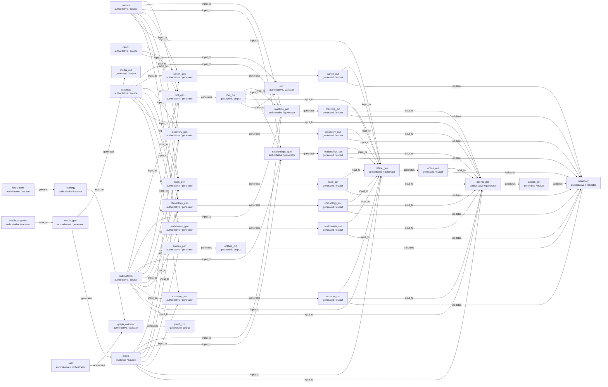

# Starsilk Source-of-Truth Derivation Graph

> GENERATED from `src/system/derivation-map.json` by `tools/validate_derivation_map.py`.
> Do not hand-edit this projection. It maps authority topology; it is not lore or canon authority.

## Coverage

Major authority/evidence groups, every Python generator in tools/build.sh, generated roots, and validation gates.

## Nodes

| ID | Role | Type | Repository paths | Scope |
| --- | --- | --- | --- | --- |
| `foundation` | authoritative | source | `MUSEUM_AI_FOUNDATION.md` | foundation |
| `content` | authoritative | source | `src/content/**` `src/templates/*` | content |
| `canon` | authoritative | source | `src/canon/AUTHORITY.md` `src/canon/invariants.json` | canon |
| `media` | evidence | source | `docs/asset-manifest.json` | media |
| `schemas` | authoritative | source | `src/schema/*.schema.json` | schemas |
| `subsystems` | authoritative | source | `src/machine/AUTHORITY.md` `src/relationships/AUTHORITY.md` `src/discovery/AUTHORITY.md` `src/tours/**` `src/chronology/**` `src/worldsvault/**` `src/museum/AUTHORITY.md` `src/offline/**` `src/agents/**` | subsystems |
| `topology` | authoritative | source | `src/system/AUTHORITY.md` `src/system/derivation-map.json` | topology |
| `media_originals` | authoritative | external | `media/source/` | media_originals |
| `media_gen` | authoritative | generator | `build/media_pipeline.py` | media_gen |
| `root_gen` | authoritative | generator | `build/generate.py` | root_gen |
| `machine_gen` | authoritative | generator | `build/machine_publication.py` | machine_gen |
| `relationships_gen` | authoritative | generator | `build/relationship_publication.py` | relationships_gen |
| `canon_gen` | authoritative | generator | `build/canon_publication.py` | canon_gen |
| `discovery_gen` | authoritative | generator | `build/discovery_publication.py` | discovery_gen |
| `tours_gen` | authoritative | generator | `build/tour_publication.py` | tours_gen |
| `chronology_gen` | authoritative | generator | `build/chronology_publication.py` | chronology_gen |
| `worldsvault_gen` | authoritative | generator | `build/worldsvault_publication.py` | worldsvault_gen |
| `entities_gen` | authoritative | generator | `build/entity_publication.py` | entities_gen |
| `museum_gen` | authoritative | generator | `build/museum_publication.py` | museum_gen |
| `offline_gen` | authoritative | generator | `build/offline_publication.py` | offline_gen |
| `agents_gen` | authoritative | generator | `build/agent_publication.py` | agents_gen |
| `build` | authoritative | orchestrator | `tools/build.sh` | build |
| `strict` | authoritative | validator | `build/validate.py` | strict |
| `boundary` | authoritative | validator | `tools/check_public_boundary.py` | boundary |
| `graph_validator` | authoritative | validator | `tools/validate_derivation_map.py` | graph_validator |
| `media_out` | generated | output | `docs/assets/media/**` | media_out |
| `root_out` | generated | output | `docs/index.html` | root_out |
| `machine_out` | generated | output | `docs/machine/**` `docs/llms.txt` `docs/sitemap.xml` | machine_out |
| `relationships_out` | generated | output | `docs/relationships/**` | relationships_out |
| `canon_out` | generated | output | `docs/canon/**` | canon_out |
| `discovery_out` | generated | output | `docs/discover/**` | discovery_out |
| `tours_out` | generated | output | `docs/tours/**` | tours_out |
| `chronology_out` | generated | output | `docs/chronology/**` | chronology_out |
| `worldsvault_out` | generated | output | `docs/worldsvault/**` | worldsvault_out |
| `entities_out` | generated | output | `docs/entities/**` | entities_out |
| `museum_out` | generated | output | `docs/objects/**` | museum_out |
| `offline_out` | generated | output | `docs/manifest.webmanifest` `docs/service-worker.js` `docs/offline-client.js` `docs/offline.html` `docs/offline.css` `docs/offline-icon.svg` | offline_out |
| `agents_out` | generated | output | `docs/agents/**` | agents_out |
| `graph_out` | generated | output | `src/system/DERIVATION_GRAPH.md` | graph_out |

## Mermaid

## Stale-risk summary

- **content** -> agents_out, canon_out, discovery_out, entities_out, machine_out, offline_out, relationships_out, root_out, tours_out
- **canon** -> agents_out, canon_out, machine_out, offline_out, relationships_out, root_out
- **media** -> agents_out, discovery_out, entities_out, machine_out, museum_out, offline_out, relationships_out, root_out, tours_out
- **schemas** -> agents_out, canon_out, chronology_out, discovery_out, machine_out, museum_out, offline_out, tours_out, worldsvault_out
- **subsystems** -> agents_out, canon_out, chronology_out, discovery_out, machine_out, museum_out, offline_out, relationships_out, root_out, tours_out, worldsvault_out
- **topology** -> graph_out
- **media_originals** -> agents_out, discovery_out, entities_out, machine_out, media_out, museum_out, offline_out, relationships_out, root_out, tours_out

## Integrity rules

- Every graph edge carries repository evidence.
- Every generated node has a declared generator.
- Derivation edges must remain acyclic.
- Every Python entrypoint invoked by `tools/build.sh` must have exactly one graph node.
- Every `tools/check_public_boundary.py` target must have exactly one generated/evidence owner.
- The checked-in Mermaid/table projection must byte-match this JSON graph.
